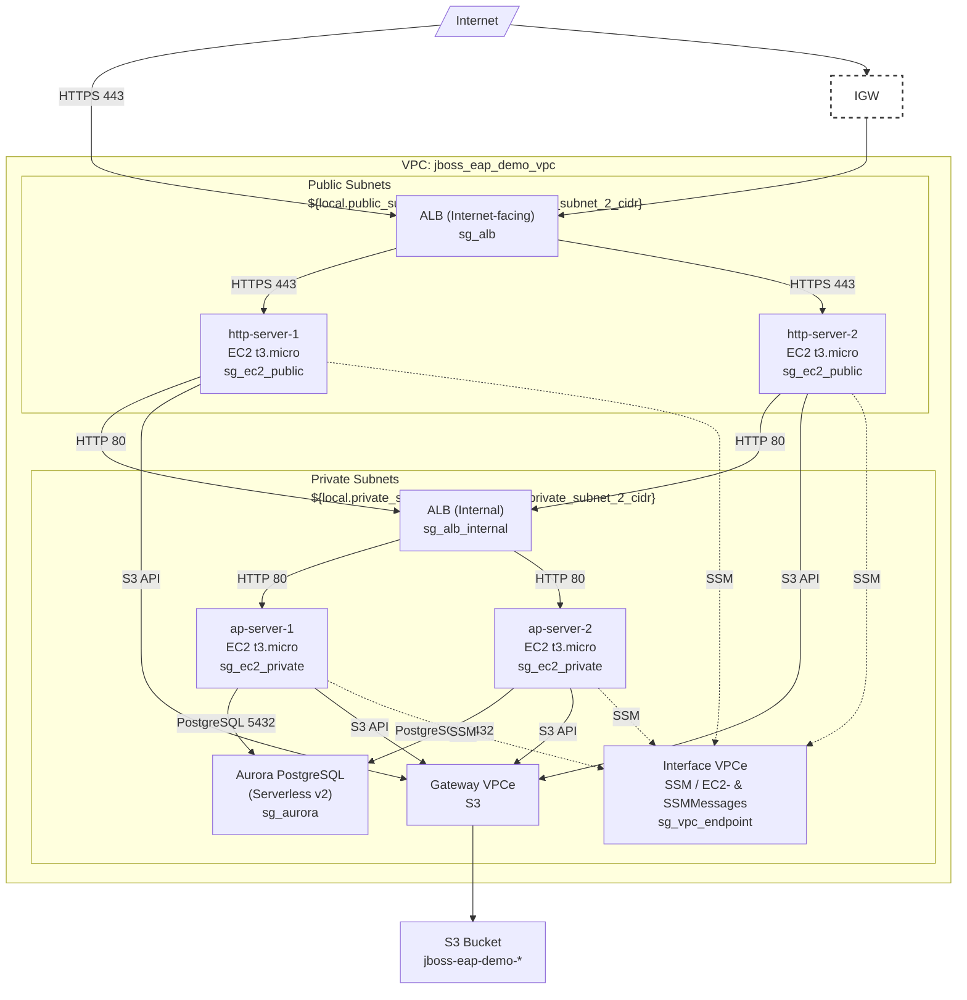

```mermaid
%% ──────────────────────────
%%  JBoss EAP Demo – System Diagram
%% ──────────────────────────
flowchart TD
  %% ── Internet
  Internet[/Internet/]

  %% ── VPC
  subgraph VPC["VPC: jboss_eap_demo_vpc\n(CIDR: ${local.vpc_cidr})"]
    direction LR

    %% ── Public Zone
    subgraph Public["Public Subnets\n${local.public_subnet_1_cidr} / ${local.public_subnet_2_cidr}"]
      ALB_Public["ALB (Internet-facing)\nsg_alb"]
      HTTP1["http-server-1\nEC2 t3.micro\nsg_ec2_public"]
      HTTP2["http-server-2\nEC2 t3.micro\nsg_ec2_public"]
    end

    %% ── Private Zone
    subgraph Private["Private Subnets\n${local.private_subnet_1_cidr} / ${local.private_subnet_2_cidr}"]
      ALB_Internal["ALB (Internal)\nsg_alb_internal"]
      AP1["ap-server-1\nEC2 t3.micro\nsg_ec2_private"]
      AP2["ap-server-2\nEC2 t3.micro\nsg_ec2_private"]
      Aurora["Aurora PostgreSQL\n(Serverless v2)\nsg_aurora"]
      S3_EP["Gateway VPCe\nS3"]
      SSM_EP["Interface VPCe\nSSM / EC2- & SSMMessages\nsg_vpc_endpoint"]
    end
  end

  %% ── S3 (outside VPC)
  S3_Bucket["S3 Bucket\njboss-eap-demo-*"]

  %% ── Traffic Flow
  Internet -->|HTTPS 443| ALB_Public
  ALB_Public -->|HTTPS 443| HTTP1
  ALB_Public -->|HTTPS 443| HTTP2

  HTTP1 -->|HTTP 80| ALB_Internal
  HTTP2 -->|HTTP 80| ALB_Internal
  ALB_Internal -->|HTTP 80| AP1
  ALB_Internal -->|HTTP 80| AP2

  AP1 -->|PostgreSQL 5432| Aurora
  AP2 -->|PostgreSQL 5432| Aurora

  %% S3 アクセス
  HTTP1 -- S3 API --> S3_EP
  HTTP2 -- S3 API --> S3_EP
  AP1   -- S3 API --> S3_EP
  AP2   -- S3 API --> S3_EP
  S3_EP --> S3_Bucket

  %% SSM 接続
  HTTP1 -. SSM .-> SSM_EP
  HTTP2 -. SSM .-> SSM_EP
  AP1   -. SSM .-> SSM_EP
  AP2   -. SSM .-> SSM_EP

  %% Internet Gateway
  IGW[IGW]:::cloud
  Internet --> IGW
  IGW --> ALB_Public

  %% クラス定義
  classDef cloud fill:#ffffff,stroke:#333,stroke-dasharray:5,stroke-width:2
```